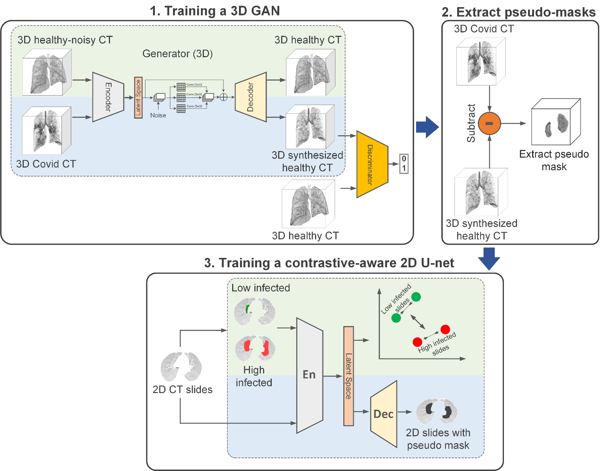

# Pipeline
The proposed pipeline has three phases: 1. Training a 3D GAN to generate synthesized healthy images: To train the generator, we use a multi-objective loss. The standard GAN objective loss (blue part) to remove infected regions from COVID-19 CT images, and reconstruct the healthy images from healthy-noisy image loss (green part) to generate the same structure of the lung as the input image. 2. Build the pseudo-mask: we extract the 3D infected area using pixel-to-pixel subtraction of the synthesized healthy image from the original COVID-19 image. 3. Developing a contrastive-aware segmentation model: To predict infected areas in 2D slices, we train a multi-objective segmentation model. The model has been trained using an end-to-end pixel-wise MSE loss (blue part) and contrastive loss (green part) which is applied to the encoder only.

# Weights of trained models in our pipeline
You can find weight of trained generator, discriminator and segmentator in the following table:

| Description | Link to weights |
| ------ | ------ |
| Trained 3D Generator | [Download](https://drive.google.com/file/d/1qyuY9pKSZusbezkaaTRUGGF7M-YWkC75/view?usp=sharing) |
| Trained 3D Discriminator | [Download](https://drive.google.com/file/d/1dEGdhkZwmhGgZgpFnMKfUmuUzIgh1Fxc/view?usp=sharing) |
| Trained 2D-Segmentor| [Download](https://drive.google.com/file/d/1MIVpsDf-vs0i7x0GO8BOV2diKkVPZYKw/view?usp=sharing)|

# Description of the codes
Our pipeline includes preprocessing, training a 3D GAN, training a 2D segmentor, and evaluation code. Here, you can find the description for each part to run on our used or your desired dataset. You can find the pipeline of our work as follow:

## [Preprocessing](https://github.com/CodeAnonymousAI/Paper-code/blob/main/Preprocess.ipynb)
The code [`Preprocess.ipynb`](https://github.com/CodeAnonymousAI/Paper-code/blob/main/Preprocess.ipynb) is used to prepare the files from raw CT scans in Nifti format to Numpy files used for training the GAN. This step consists of three main parts. In this first step, we load the images from Nifti format and limit the pixel value to a range of (-1000,400) based on HU (Hounsfield Unit). Then we set the Pixel-Spacing to [1,1,1]. The next step is extracting the lung area from the whole image. We used [LungMask](https://github.com/JoHof/lungmask) open-source library to extract the lung. In the last step of preprocessing, we reduced the size of the lung in the center of the image to 32×128×128 by cropping and resizing. Finally, we save it in .npy format for future use. The preprocessed data used to train and evaluate our model are listed below:

1- [Mosmed](https://drive.google.com/file/d/1CC8pu0YT5Olc0asSTQNkRAucLje-_by2/view?usp=sharing)

2- [Radiopedia](https://drive.google.com/file/d/1yBq3Q6bDhgmYuuhvVNoepGqeZL6WnFw3/view?usp=sharing)

3- [Cronacases](https://drive.google.com/file/d/1sZcYaJg3VO93zQS6p2QdSRE9z9ztw1vU/view?usp=sharing)

4- [UESTC](https://faculty.uestc.edu.cn/HiLab/en/article/379152/list/index.htm) : We don't have permission to share this dataset in our github based on our consent. Users need to sign a consent with the owner to access to this dataset. 

## [Training the GAN](https://github.com/CodeAnonymousAI/Paper-code/blob/main/GAN3D.ipynb)
To train GAN ([`GAN3D.ipynb`](https://github.com/CodeAnonymousAI/Paper-code/blob/main/GAN3D.ipynb)), we used preprocessed Healthy and Covid-19 cases. We need to save `LungImages.npy` for healthy (as `train_control` in the code) and Covid-19 (as `train_covid` in the code) cases separately. 
#### In code:
| Code | Description |
| ------ | ------ |
|`train_covid = np.load('.../train_covid_cropped.npy')`  |Input directory for covid cases|
|`train_control = np.load('.../train_control_cropped.npy')`|Input directory for healthy cases|
|`.../generator_model`|directory for saving the generator model|
|`.../discriminator_model`|directory for saving the discriminator model|

## [Training the Segmentor](https://github.com/CodeAnonymousAI/Paper-code/blob/main/Segmentation2D.ipynb)
For training the final segmentor ([`Segmentation2D.ipynb`](https://github.com/CodeAnonymousAI/Paper-code/blob/main/Segmentation2D.ipynb)), we use a Unet model which is trained by MSE and contrastive loss.
#### In code:
| Code | Description |
| ------ | ------ |
|`input_lung = np.load('.../input_lung.npy')`  | The Covid-19 slices of the inputs which fed to GAN model |
|`out_gan = np.load('.../output_lung_gen.npy')`  |The output of the GAN to 'input_lung' |
|`.../my_train_en_con`  |Weights of encoder part of Unet|
|`.../my_en_de`  |Weights of Unet|

## [Evaluation](https://github.com/CodeAnonymousAI/Paper-code/blob/main/Evaluation.ipynb)
The evaluation code is in [`Evaluation.ipynb`](https://github.com/CodeAnonymousAI/Paper-code/blob/main/Evaluation.ipynb). You can use the code to evaluate your own code.

